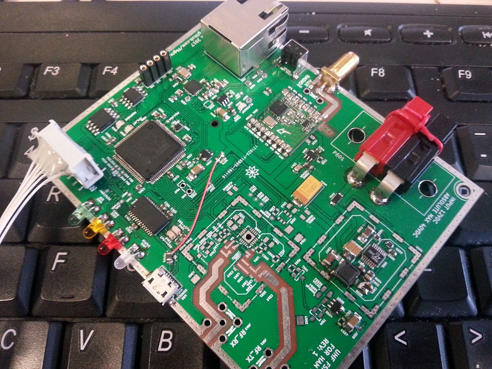

# hn70ap
Development board for modern packet radio on UHF



This repository contains sources for a few kicad projects and a NuttX board
support package for the board.

The main schematic and additional schematics and board designs are released
under the CERN OHL license.

Prerequisites
=============
 * linux (in 2017 there are many ways to get that)
 * a micro-usb cable to see the debug uart output
 * a jtag/swd adapter
 * a working openocd installation
 * an arm-none-eabi toolchain: https://launchpad.net/gcc-arm-embedded
 * to change the default configs: install kconfig-frontends
 
Mandatory: Install toolchain
============================
The arm-none-eabi toolchain provided by your distro probably does not work OK
(from experience). You may be lucky but this is not widespread enough. So we're
installing a really working toolchain.

The hardest way: compile a toolchain
------------------------------------
Hey this is a beginner guide. you dont need my guide if you are doing that. Help
yourself!

The hard way: download and install
----------------------------------

Open a bash shell console, then type commands ONE BY ONE (adapt them if you know
what you are doing):
```
$ cd $HOME
$ mkdir toolchains
$ cd toolchains
$ wget -O toolchain.tar.bz2 https://launchpad.net/gcc-arm-embedded/5.0/5-2016-q3-update/+download/gcc-arm-none-eabi-5_4-2016q3-20160926-linux.tar.bz2
$ tar jxvf toolchain.tar.bz2
$ cd $HOME
$ export PATH=$PATH:$HOME/toolchains/gcc-arm-none-eabi-5_4-2016q3/bin
```
The last line makes the ARM compiler available in your shell environment. You
can make that automatic, search the web. Otherwise you have to execute this last
line in each new shell window.

The easy way for ubuntu based distros
-------------------------------------

There is a ppa
```
sudo add-apt-repository ppa:team-gcc-arm-embedded/ppa
sudo apt-get update
sudo apt-get install gcc-arm-embedded
```

Toolchain test
--------------

You can test that the toolchain is functional by typing this command and
expecting this answer:
```
$ arm-none-eabi-gcc
arm-none-eabi-gcc: fatal error: no input files
compilation terminated.
```

If the command is not found, then the toolchain is not correctly installed and
the following will NOT work.

Optional: kconfig-frontends
===========================
Skip for now.
TODO, https://bitbucket.org/nuttx/tools, ./configure && make && make install

openocd
=======
Skip for now. TODO apt-get or ./configure && make && make install

Basic Build
===========
You need a working NuttX development environment:

```
$ mkdir nuttx
$ cd nuttx
$ git clone https://bitbucket.org/nuttx/nuttx
$ git clone https://bitbucket.org/nuttx/apps
$ cd nuttx
```
Then you can clone the board config in the proper directory
(This is NOT a submodule!)
```
$ cd configs
$ git clone https://github.com/f4grx/hn70ap
$ cd ..
```

Then choose any of the following test configurations
```
$ tools/configure.sh hn70ap/build/0_boot
```
```
$ tools/configure.sh hn70ap/build/1_memories
```
```
$ tools/configure.sh hn70ap/build/2_oled
```
And build the binary image for this board:
```
$ make
```
This should end up with an ELF binary 'nuttx', and binary images nuttx.bin

You then have to flash this binary on your board, probably with OpenOCD.

This will give you a basic shell, type help to show basic commands. This can be used to validate the behaviour of the board's CPU.

Flashing without JTAG
=====================

This will be possible later, when the bootloader is made ready. The hardware is ready to support that.
A python tool will build an update image from the nuttx elf output, and you will be able to send that image via ethernet or serial.

The bootloader is currently being written. The algorithm is as follows: At CPU startup, the external flash is initialized and searched for a firmware update, except when the button is pressed. If the update is valid, it is applied. If a failure happens, or the button has been pressed, enter a serial download mode. This mode will expect a firmware update image on the serial port and then write it to the external flash. Once done, an update attempt will be attempted after a reboot.

Advanced build
==============
More configurations will be added later that can be used to test ethernet, spi/i2c memories, etc

To modify the nuttx options type make menuconfig and mess around.

To get useful behaviour from this board you will need to add some applications that are not developed yet.
